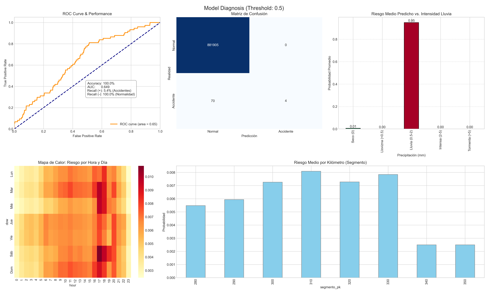

I forked this repositoy for my personal future projects from https://github.com/adrianaavilees/Vehicle-Accident-Predictor
Thanks Adriana for inpire the comunity with thism great project

# 🚔 AP-7 Highway Accident Risk Prediction System


A Machine Learning powered dashboard that predicts the probability of traffic accidents along the **AP-7 highway in Catalonia**. By analyzing historical accident reports, road geometry, and meteorological conditions, this system provides real-time risk assessment to help improve road safety.

<div align="center">

## 🔴 **Live Demo**
Click the image below to launch the interactive dashboard:

[](https://predict-vehicle-accidents.streamlit.app/)

*Explore real-time risk heatmaps, weather simulation, and 24h forecasts.*

</div>

---

## 📖 Project Overview

This project aims to predict **Binary Accident Risk (Accident vs. No Accident)** for specific 10km segments of the highway. It uses **XGBoost**, a gradient boosting algorithm, trained on data from **Open Data Catalonia** (2010-2023).

The system accounts for:
* **Temporal Features:** Hour of day, day of week, month (cyclical encoding).
* **Meteorology:** Rain, wind, humidity, fog, and sun glare (via MeteoCat XEMA network).
* **Infrastructure:** Road geometry, speed limits, and specific "black spots."
* **Feature Crosses:** Complex interactions like `wet_road_at_night` or `wind_in_critical_zones`.

## 📸 Model Validation & Performance

The model was validated using a time-series split (training on past data, testing on the most recent 20% of data). Special attention was paid to **Recall** to minimize false negatives (missing a potential accident).


*(Above: The diagnostic dashboard generated by `validation.py`, showing the ROC Curve, Confusion Matrix, and Risk Heatmaps by hour/day).*

**Key Metrics:**
* **ROC AUC:** Indicates the model's ability to distinguish between safe and dangerous situations.
* **Recall:** Optimized to ensure high-risk situations are flagged.
* **Heatmap Analysis:** Visualizes that the model correctly identifies rush hours and weekends as higher risk periods.

---

## 🚀 Features

### 1. Interactive Dashboard (`app_demo.py`)
* **Real-time Risk Heatmap:** Visualizes risk levels on a Folium map overlaying the official AP-7 geometry.
* **Scenario Simulation:** Toggles for Rain, Fog, or Wind to see how conditions affect safety.
* **24-Hour Forecast:** Predicts the evolution of risk for the next 24 hours based on time cycles.
* **Top Alerts:** Identifies the specific kilometer points (PK) with the highest immediate danger.

### 2. Robust Data Pipeline
* **`geometry_coordinates.py`**: Fetches the exact path of the AP-7 using the **Overpass API (OpenStreetMap)**.
* **`get_meteocat.py`**: Scrapes historical weather data from nearby stations (XEMA) via the Socrata API.
* **`create_dataset.py`**: Merges spatiotemporal grids, handles missing values, and performs feature engineering.

---

## 📂 Project Structure

```bash
├── app/
│   ├── app_demo.py          # Main Streamlit Dashboard application
│   └── geometry_coordinates.py
├── data/
│   ├── ap7_geometry.geojson # Generated road geometry
│   ├── meteo_history/       # Historical weather data
│   └── AP7_Final_Training_Set.csv
├── models/
│   └── accident_xgboost.pkl # Trained ML model
├── scripts/
│   ├── get_meteocat.py
│   ├── data_preprocessing.py
│   ├── create_dataset.py
│   ├── train_xgboost.py
│   └── validation.py
├── requirements.txt
└── README.md
```

---

## 🛠️ Installation & Usage

### 1. Clone the repository
```bash
git clone https://github.com/adrianaavilees/Vehicle-Accident-Predictor.git
cd Vehicle-Accident-Predictor
```

### 2. Install Dependencies
```bash
pip install -r requirements.txt
```

### 3. Data Generation (Optional if data is present)
If you want to rebuild the dataset from scratch, run the scripts in this order:

```bash
# 1. Fetch road geometry from OpenStreetMap
python scripts/geometry_coordinates.py

# 2. Fetch weather data from Open Data Catalonia
python scripts/get_meteocat.py

# 3. Create the training dataset (merges accidents + meteo + geometry)
python scripts/create_dataset.py
```

### 4. Train the Model
```bash
python scripts/train_xgboost.py
```
*This will generate the `accident_xgboost.pkl` file in the `models/` folder.*

### 5. Run the Dashboard locally
To launch the Streamlit app on your local machine:
```bash
streamlit run app/app_demo.py
```

---

## 🔗 References & Data Sources

The accuracy of this model relies on open data provided by the **Generalitat de Catalunya** and the **Government of Spain**.

### Historical Data (Model Training)
* **Traffic Accidents:** [Accidentes de tráfico con fallecidos o heridos graves](https://datos.gob.es/ca/catalogo/a09002970-accidentes-de-trafico-con-fallecidos-o-heridos-graves-en-cataluna)  
    *Primary dataset containing geolocation and details of serious accidents used to train the XGBoost classifier.*
* **Meteorological Context:** [Dades meteorològiques de la XEMA](https://analisi.transparenciacatalunya.cat/Medi-Ambient/Dades-meteorol-giques-di-ries-de-la-XEMA/7bvh-jvq2/about_data)  
    *Historical weather data from the Automatic Weather Stations Network (XEMA) to correlate accidents with environmental conditions.*

### Real-Time Data (Inference & Validation)
* **Weather API:** [MeteoCat API](https://apidocs.meteocat.gencat.cat/)  
    *Official API used to fetch live weather conditions (Temperature, Rain, Wind) for real-time risk prediction.*
* **Live Traffic Incidents:** [Incidències viàries en temps real](https://analisi.transparenciacatalunya.cat/Transport/Incid-ncies-vi-ries-en-temps-real-a-Catalunya/uyam-bs37/about_data)  
    *Real-time feed of current road incidents.*
* **Periodic Traffic Reports:** [Incidències viàries (Periodic Update)](https://analisi.transparenciacatalunya.cat/Transport/Incid-ncies-vi-ries-a-les-carreteres-de-Catalunya/5wp5-7t2p/about_data)  
    *Non-real-time incident logs used for validation and pattern analysis.*

---
<div align="center">
  Made with ❤️ using Python & Streamlit
</div>
